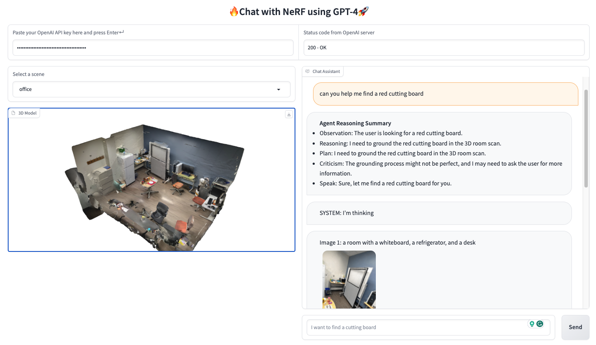

# :camera_flash: Chat with NeRF: Grounding 3D Objects in Neural Radiance Field through Dialog

[](https://chat-with-nerf.github.io/)
[](http://sled-whistler.eecs.umich.edu:7777/)
[](https://discord.gg/8rT4GpRq9g)
[](https://i.ibb.co/kBSCWsD/IMG-6239.jpg)



## :bulb: Highlight

- **Open-Vocabulary 3D Localization.** Locate **anything** with natural language dialog!
- **Dynamic Grounding.** Humans will be able to chat with agent to localize novel objects.

## :fire: News
[2023-05-15] The first version of chat-with-nerf is available now! Please try out demo!
## :star: Explanations/Tips for Chat with NeRF Inputs and Outputs

## :label: TODO
- [ ] A faster process to determine camera poses and rendering pictures. See discussion [here](https://github.com/sled-group/chat-with-nerf/issues/15#issuecomment-1556223848).
- [ ] Use [LLaVA](https://llava-vl.github.io/) to replace GPT-4-text-only + BLIP for an end-to-end multimodal grounding pipeline.

## :hammer_and_wrench: Install

To install the dependencies we provide a Dockerfile:
```bash
docker build -t chat-with-nerf:latest .
```
Or if you want to pull remote image from Dockerhub to save significant time, please try:
```bash
docker pull jedyang97/chat-with-nerf:latest
```

Otherwise, if you prefer build it locally:
```bash
conda create --name nerfstudio -y python=3.8
conda activate nerfstudio
pip install torch==1.13.1 torchvision functorch --extra-index-url https://download.pytorch.org/whl/cu117
pip install ninja git+https://github.com/NVlabs/tiny-cuda-nn/#subdirectory=bindings/torch
pip install nerfstudio

git clone https://github.com/kerrj/lerf
python -m pip install -e .
ns-train -h
```
Note that specific CUDA 11.3 is required. For further information, please check nerfstudio installation
guide.

Then locally you need to run
```bash
git clone https://github.com/sled-group/chat-with-nerf.git
```
If using Docker, you can use the following command to spin up a docker container with **chat-with-nerf** mounted under workspace
```bash
docker run --gpus "device=0" -v /<parent_path_chat-with-nerf>/:/workspace/ -v /home/<your_username>/.cache/:/home/user/.cache/ --rm -it --shm-size=12gb chat-with-nerf:latest
```
Then install Chat with NeRF dependencies
```bash
cd /workspace/chat-with-nerf
pip install -e .
pip install -e .[dev]
```
(or use your favorite virtual environment manager)

To run the demo:

```
cd /workspace/chat-with-nerf
export $(cat .env | xargs); gradio chat_with_nerf/app.py
```

## Related Work
- [nerfstudio](https://github.com/nerfstudio-project/nerfstudio)
- [LERF](https://github.com/kerrj/lerf)
- [BLIP-2](https://huggingface.co/docs/transformers/main/model_doc/blip-2)
- [LLaVA](https://github.com/haotian-liu/LLaVA)

## Citation
```
 @misc{chat-with-nerf-2023,
    title = {Chat with NeRF: Grounding 3D Objects in Neural Radiance Field through Dialog},
    url = {\url{https://github.com/sled-group/chat-with-nerf}},
    author = {Yang, Jianing and Chen, Xuweiyi and Qian, Shengyi and Fouhey, David and Chai, Joyce},
    month = {May},
    year = {2023}
}
```
